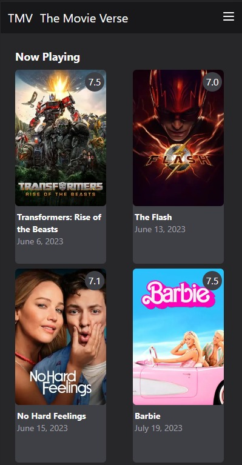
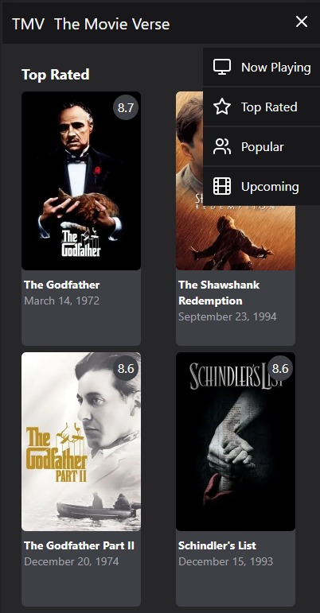
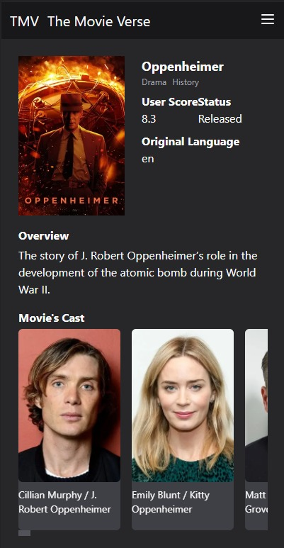

# The Movie Verse

This is a project that I made to get used with the new Next.js updates and learn how to use Tailwindcss

## About

- I used the [TMDB][tmdb] api to get the movies data
- The site is completly responsive

## Images





## Run project

First install the packages:

```bash
npm install
# or
yarn install
# or
pnpm install
```

Run the development server:

```bash
npm run dev
# or
yarn dev
# or
pnpm dev
```

Then open the browser in `http://localhost:3000/` url

[tmdb]: https://www.themoviedb.org/
